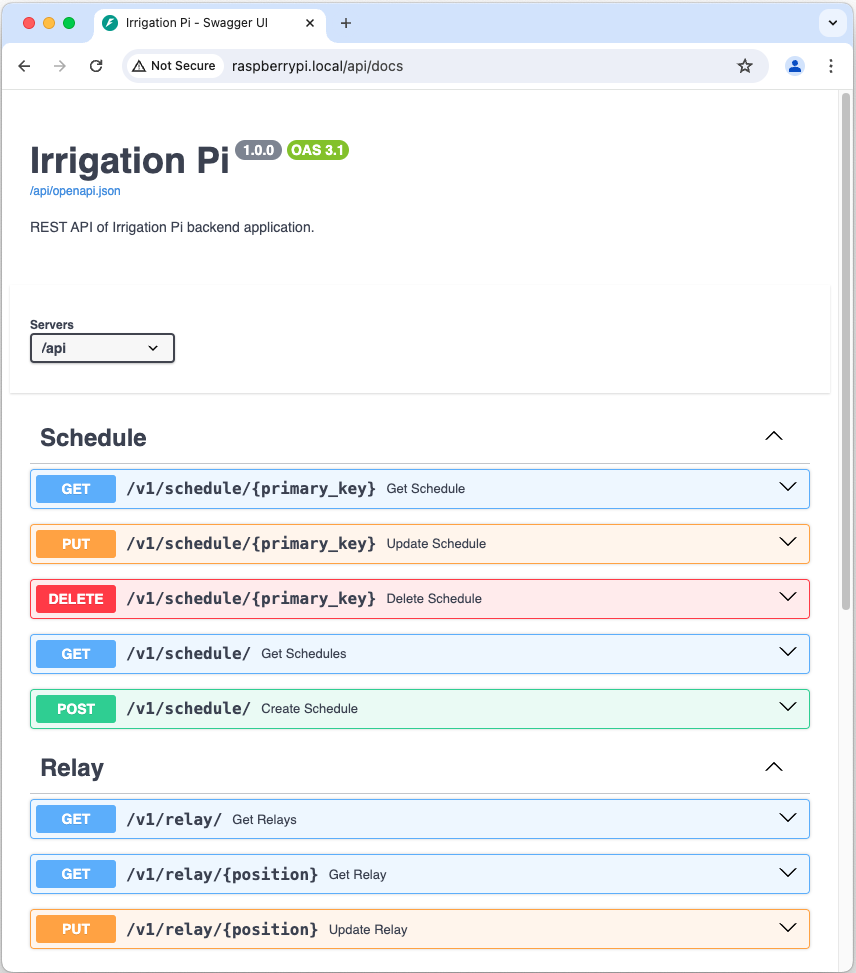

[](https://python-poetry.org/)
[](https://github.com/astral-sh/ruff)
[](https://codecov.io/gh/max-pfeiffer/irrigation-pi)


# Irrigation Pi
This web application turns your [Raspberry Pi](https://www.raspberrypi.com/) into an irrigation system.

There are several relay HATs from various manufactures available for the [Raspberry Pi](https://www.raspberrypi.com/).
This application currently supports the following boards:
* [Waveshare RPi Relay Board](https://www.waveshare.com/wiki/RPi_Relay_Board) (3 relays)

Contributions for other boards are warmly welcome.

   



## Features
* Add schedules for switching the relays
* Relays are switched automatically according to schedule configuration
* Mobile friendly web interface ([Angular](https://angular.io/) [frontend application](frontend/README.md) written in Typescript)
* REST API ([FastAPI](https://fastapi.tiangolo.com/) [backend application](backend/README.md) written in Python)

## Installation on Raspberry Pi
Installation on your Raspberry Pi is **easy**! It is quickly done within minutes.

Requirements:
* Raspbian GNU/Linux v11+
* git v2.30+
* Python v3.9+

Open a shell on your Raspberry Pi and clone this repository:
```shell
git clone https://github.com/max-pfeiffer/irrigation-pi.git
```

The go to project directory and run a script to install Poetry and Python package dependencies:
```shell
cd irrigation-pi
./install_poetry.sh
```
Depending on your Raspberry Pi's computing power and your network connection this might take a while.
On a Raspberry Pi 2 or 3 you need to be patient. :smiley: If package installation seems to got stuck,
just exit the script (CTRL-C) and re-run it.

Activate the virtual environment. Then install application dependencies and configuration files (irrigation-pi
application, nginx and systemd) using the management CLI:
```shell
source .venv/bin/activate
irrigation-pi install all
```
The management CLI requires superuser privileges for installation. If you encounter a password challenge, please enter your user's
password.

The application is available on http://raspberrypi.local/ afterwards. The API can also be used directly
on http://raspberrypi.local/api.

## Configuration
Configuration files are generated by the management CLI during initial installation. Configuration of the
Irrigation-Pi application is done via the config.toml file in project directory:
```
[backend]
# Possible options are: rpi_gpio, pigpio, native
pin_factory_type = "rpi_gpio"

# Possible options are: waveshare_rpi_relay_board
adapter_type = "waveshare_rpi_relay_board"
```
This file can be altered after the installation if the default settings do not suit you. Currently, you can only tweak
the GPIO driver.

The backend application is served with [Uvicorn](https://www.uvicorn.org/) application server. This process is managed
by systemd. You can find the systemd service definition in `/etc/systemd/system/irrigation-pi.service` on your Raspberry Pi.

The frontend application is served with [nginx](https://nginx.org/) web server. The site configuration file can be
found in `/etc/nginx/sites-available/irrigation-pi` on your Raspberry Pi.

## Roadmap
Following features are on our todo list:
* Validate schedules to avoid collisions
* View for live relay switching
* View for Raspberry Pi system information
* Make host name for Raspberry Pi installation configurable
* SSL for web application

## Why another irrigation controller software for the Raspberry Pi?
First of all I was searching GitHub and the web for ready to use solutions. And I found a couple.
Some of them did not match my use case: I just want a simple and easy to use application for watering plants on my
balcony and in my garden. I have no need for watering zones, sensors or other complications. These things need a lot of
effort to set up and maintain. Not only software configuration but also the hardware, wiring, pipes etc.
And I am a lazy person and a lazy gardener. :smiley: I like to keep things simple and work less.

Also, a lot of these projects on GitHub did grow out of hand for the maintainers and are now outdated or simply do not
work anymore. Often they leverage big ass frameworks, databases like MongoDB or depend on Docker. All this I do not
want to run on my good old Raspberry Pi 3 with little computing power. And no, I do not want to buy a Raspberry Pi 5
for 120 Euro for simple use cases like watering my plants on the balcony when a device for 30 Euro can do the job.

Also, I want to use my Irrigation-Pi in my garden where I only have solar power from a battery. Here I have an island
solution and the need for very little power consumption. The latest Raspberry Pi hardware versions suck a lot more
energy than the old boards.

This project aims to just use what comes with Raspbian OS pre-installed with very little other dependencies.
Also, installation, updates or maintenance should be fully automated. I do want to mess around on my Pi with config and
software updates. And because I am lazy. :smiley:
